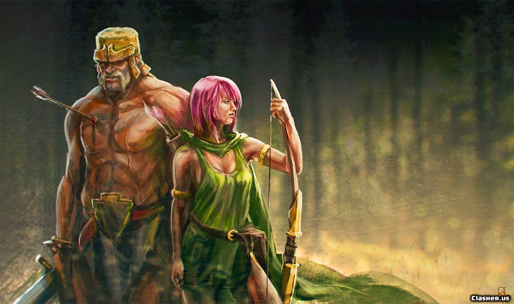

<h1 align="center">GIB IHM</h1>
<h2 align="center">Abschlussaufgabe</h2>
<h3 align="center">Michel Lobbos</h3>
 

  

## Die Helden:
                       
                        HP      N.Angriffschaden-Wert      B.Schaden-Wert       Heilung
1. Barbar
 
                      750               210                     350               70
2. Archer
 
                      550               220                     375               65
3. Wizard

                      450               230                     400               60

+ Alle Helden können ein Verteidigung-Schild Aktivieren.
  (wenn das Verteidigung-Schild Aktiv ist, Alle Helden bekommen 200 Schaden weniger wenn der gegner Sniper-Schuß schießt, gilt nur für diese Runde.)

## Die Gegner:

                      HP      N.Angriffschaden-Wert      feuer-Regen         sniper          Bandage               Schild                        Super-Schild
1. Böser Goblin

                    750      300 (alle Helden)          200(alle)       600(ein Held)        100          50 weniger bei N-Angriff        100 weniger bei B-Angriff 
2. Bika

                   1000      300 (alle Helden)          200(alle)       600(ein Held)        100          50 weniger bei N-Angriff        100 weniger bei B-Angriff  

+ Die Helden kempfen zuerst gegen Böser Goblin, erst wenn Böser Goblin besiegt wird, kommt der BIKA 